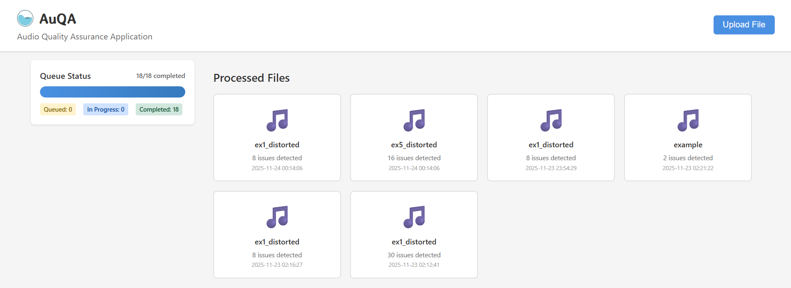
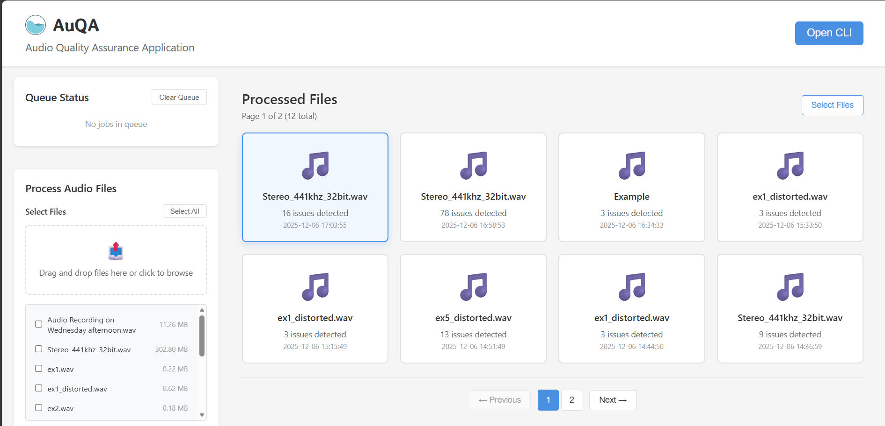

# Audio QA App (AuQA)



AuQA is an audio quality assurance tool that analyzes audio files for common artifacts such as clipping, cutouts (dropouts), and perceptual quality issues. The web frontend lets you upload audio, browse processed files, inspect per-file detection reports and clips, and launch the CLI client from the UI.

## Features

- Detects in-file artifacts (clipping, dropouts, distortion regions)
- Computes overall metrics (sample rate, channels, duration, loudness indicators)
- Per-window MOS (mean opinion score) detection using `squim` (or a simple fallback estimator)
- Saves per-file reports and example audio clips into `detection_results/`
- Small React frontend for browsing results and launching the CLI

## Prerequisites

- Python 3.8+ (recommended) and `pip`
- Node.js + npm (for frontend) if running the UI locally
- Redis server (used by the job queue)

Redis (Windows): https://github.com/tporadowski/redis/releases

On macOS/Linux you can install Redis via your system package manager (e.g. `brew install redis` or `apt install redis-server`).

## Install (local development)

1. Clone the repository and enter the directory:

```bash
git clone https://github.com/PBS-Wisconsin-Team-1/audio-qa-app.git
cd audio-qa-app
```

2. (Recommended) Create and activate a Python virtual environment:

Windows (PowerShell):
```powershell
python -m venv .venv
. .venv\Scripts\Activate.ps1
```

macOS / Linux:
```bash
python -m venv .venv
source .venv/bin/activate
```

3. Install Python dependencies:

```bash
pip install -r requirements.txt
pip install -e .
```

4. Install frontend dependencies:

```bash
cd frontend
npm install
cd ..
```

## Starting the app

Two convenience scripts are provided to start all services at once (Redis, API, workers, RQ dashboard and optional CLI):

- PowerShell (Windows):

```powershell
cd scripts
./start_all.ps1
```

- Shell (macOS / Linux):

```bash
cd scripts
bash start_all.sh
```

After starting, the web UI is available at `http://localhost:3000` (if frontend running locally) and the RQ dashboard is at `http://localhost:9181`.

To stop all services:

Windows (PowerShell):
```powershell
cd scripts
./stop_all.ps1
```

macOS / Linux:
```bash
cd scripts
./stop_all.sh
```

## Usage



1. Open the AuQA frontend (`http://localhost:3000`) and use the **Upload File** button to upload an audio file (or place audio files in the configured `audio_files/` directory).
2. The backend processes files using a Redis-backed job queue. Processed reports appear in the gallery.
3. Click a file in the gallery to view detections, play saved clips, and inspect metadata.
4. Use the **Open CLI** button in the header to launch the `auqa-cli` client on the same machine as the API server (useful for advanced queue/worker interactions).

The sample screenshot above (`assets/AuQA_screenshot.png`) shows the gallery, detection list and playback/clip viewer.

## Notes & Troubleshooting

- Ensure Redis is running and reachable at `localhost:6379` (or set `REDIS_URL` env var).
- If `torchaudio.prototype.squim` is unavailable in your environment, the project falls back to a simple MOS heuristic — see `src/audio_processing/squim_detector.py`.
- If the frontend is slow to start, try deleting `node_modules` and re-running `npm install`, or check Node.js version compatibility.
- When running in Docker, set `AUDIO_FILES_PATH` in your env before `docker-compose up` if you want to mount a custom audio folder.

## Development

- Backend API: `src/job_queue/api_server.py`
- Worker and job queue: `src/job_queue/worker.py`
- Frontend: `frontend/src`

## License

This project is distributed under the terms in the repository `LICENSE` file.

---
For more details, visit the project repository.
